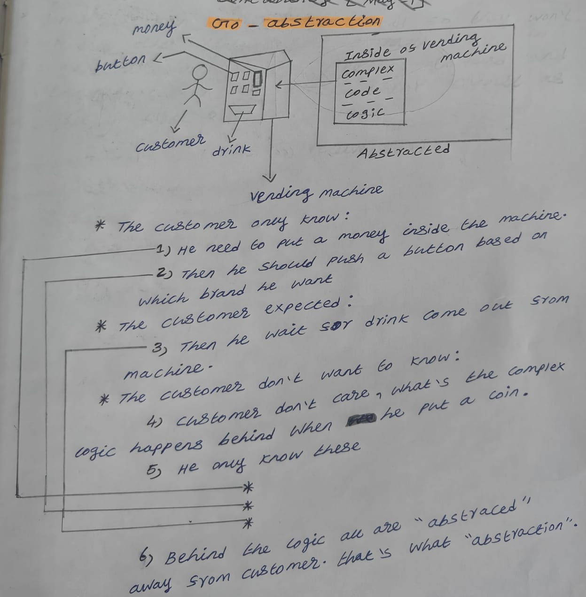

# Explanation - 1

- Reference [link](https://www.youtube.com/watch?v=CRY4_-p5FgM&ab_channel=KantanCoding)


---


[Example](example/main.go)

- Thing `vm` is third-party package we're going to use in our project.
- We don't need to know about How they implemented that functionlity we just need to know
  How to work with for getting deseried result we want.
- **EXample** : `fmt` package in Golang we don't know What inside that package and how they implemented
   all functionlitys.
    - we Know what to call for printing that data,that's it all implementations are abstracted away from us.
    - we know what to give and what will get as a return value,that's it.

# Explanation - 2

- Abstraction in Go allows to hide the implementation details of a program and expose only the necessary information to the user.
- It is achieved by using interfaces which define the methods a struct should have.
- This allows the program to work with any struct that implements the interface, regardless of its specific type.

```go
package main

import "fmt"

// Shape is an interface that defines the methods a shape should have.
type Shape interface { 
    area() float64
}

// Hidden Detail start

// Rectangle represents a rectangle shape.
type Rectangle struct {
    width, height float64
}

func (r Rectangle) area() float64 {
    return r.width * r.height
}

// Circle represents a circle shape.
type Circle struct {
    radius float64
}

func (c Circle) area() float64 {
    return 3.14 * c.radius * c.radius
}


// Hidden Detail End

func NewShape(s Shape) { 
    fmt.Println("Area of :", s.area())
}

func main() {
    var shape Shape
    shape = Rectangle{5, 10}
    NewShape(shape)
    shape = Circle{7}
    NewShape(shape)
}
```

# Summary
**In programming, abstraction is the process of hiding the implementation details of a program** and exposing only the necessary information to the user. It allows for simplified interactions with the program by reducing the complexity of the underlying code.

# Example :
  - Based on this example we exposed only **NewShape** but NewShape doesn't know the Implementation where we call
    the function it don't care about the Implementation at all.