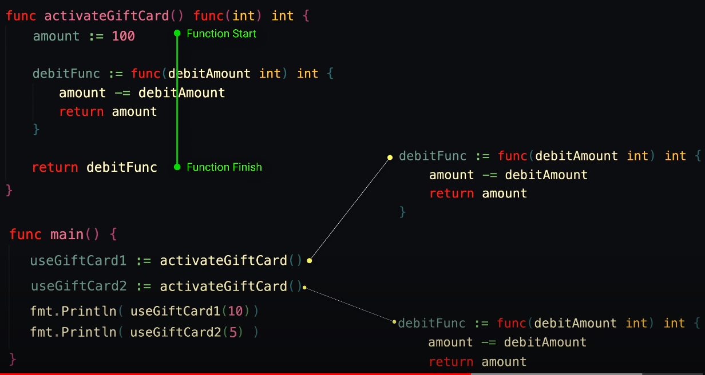
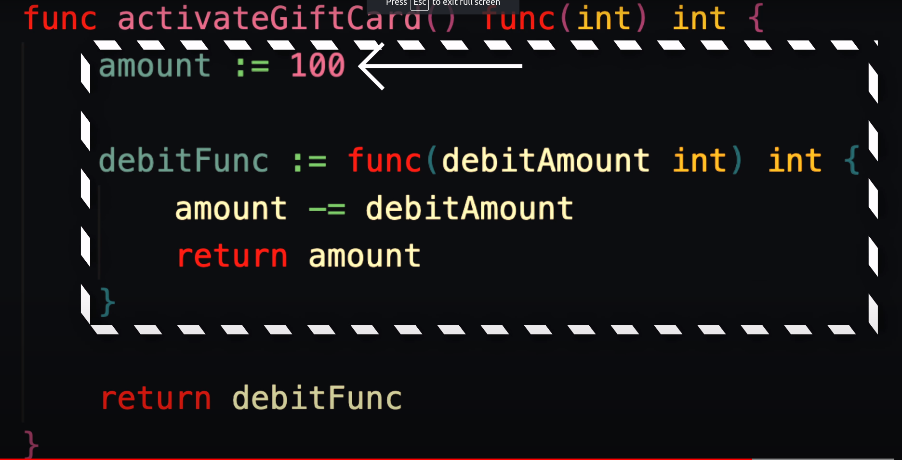

# Example
> Let's imagine we have a function like this.

> When we invoke the function which will return fucntion as a value.

> So you might be wondering how is this debitFunc function accessing this amount

> Like you expect that once this activate gift card function returns and finish

> This variable amount which's part of this activate gift card function scope would be erased from memory right
 

> So how does debitFunc still have the amount to even reference or subtract from well the answer to that my friends is closure
 

> The first time this function gets called we're setting an intial amount of 100 
 

> And then we create a debitFunc
 

> That can later use the gift card and subtract from the intial amount
 
 

> Now since the debitFunc function depends on a variable outside of itself 
 

> Under the hood the programming language will Enclose both the debitFunc function and any variable that depends on that are defined outside of itself
 

> And store it  in  memory as an enclosed unit or closure
 

> So what's being referenced in memory by this use gift card one variable is actually something that looks like this and for use gift Card 2 we're once again calling activate gift card a second time and when we call it the second time another separate closure will get stored in memory and referenced by use gift card 2
 

> So when we call both of these use gift card functions they're actually subtracting from their own amounts that are contained within own individual closures in memory.
 

 ### Benefits of Closures:

- **State Management:** Closures allow functions to maintain their own state, which is useful for scenarios like creating stateful iterators or implementing custom error handling logic.
  
- **Encapsulation:** By capturing variables from the enclosing scope, closures can encapsulate data and behavior within a single unit, promoting modularity and code organization.
  
- **Callback Functions:** Closures are commonly used as callback functions that can be passed around and executed later with access to specific data from their creation context.

### Important Note:

- Closures can potentially lead to memory leaks if variables they capture are long-lived and not garbage collected. Be mindful of the scope and lifetime of variables used in closures.

