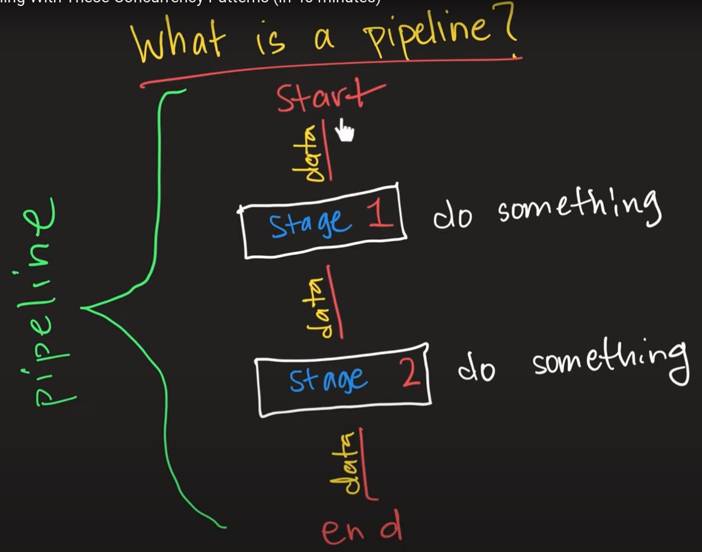

# Concurrency Pattern

## For - select loop

### send Channel

```go
package main

import(
	"fmt"
)

func main(){
	charchannel := make(chan string,3) // Unbuffered Channel.
	chars := []string{"a","b","c"}

	for _,s := range chars{
         select {
		 case charchannel <- s:
			 fmt.Println("Case-1")
		 }
	}

	close(charchannel)

	/*
	  # we can loop over the closed channel.
	 
	*/
	 
    for result := range charchannel {
		/*
		 # Once we close the channel,there's a flag internally it will tell the channel's open or close
		   and where that channel closed (range)
		 # So when it reached the close channel it will know,it should end the loop.
		*/
		fmt.Println(result)
	}

}
```
### Output 

```go
lect-loop.go 
Case-1
Case-1
Case-1
a
b
c
```

```go
package main

import (
    "fmt"
)

func main() {
    // Create a buffered channel with capacity 2
    dataChannel := make(chan string, 2)

    // Data to send (can be any data type)
    data := []string{"apple", "banana", "cherry", "orange"}

    for _, item := range data {
        select {
        case dataChannel <- item: // Case for sending data
            fmt.Println("Sent:", item)
        default:
            fmt.Println("Channel full, waiting...")
        }
    }

    // Close the channel after sending
    close(dataChannel)

    // Receive and print remaining data (if any)
    for result := range dataChannel {
        fmt.Println("Received:", result)
    }
}

```
### Output
```go
go run for-select-loopsample1.go 
Sent: apple
Sent: banana
Channel full, waiting...
Channel full, waiting...
Received: apple
Received: banana
```

- First case try to send data to `dataChannel` channel.
- If the channel has space (less than 2 elements currently), the send operation succeeds, and a message is printed.
- If the channel is already full (2 elements), the program falls through to the `default` case.
#### Summary 
- If there's a space in that channel it will go to that one or else it will go to next case.
#### Where it's useful
- If we work with multiple goroutine got lots of data then we need to work with more channels then check it's full
  if it's then we should send that on other channel.

  ### Receive channel 

  - We can use for waiting multiple goroutine response without blocking.
  - if we got one response,it will execute the process below on the case then it come out from `select` block.

## Done Pattern

```go
package main

import(
	"fmt"
	"time"
)

func doWork(done <-chan bool){
	for{
		select{
		case <-done:
			return
		default:
			fmt.Println("Doing Work....")
		}
	}
}

func main(){
    done := make(chan bool)

	go doWork(done)

	time.Sleep(time.Second*1)

	close(done)

}
```
- `done` pattern useful for avoid the **goroutinr leak**.

### Channels State

**There're three state's**
   - Nil Channel
   - Empty Channel
   - Closed Channel

#### 1) Nil Channel

##### Sending to a nil channel

```go
package main

import(
	"fmt"
)

func receivor(ch chan *int){
	 i := 1
	// Sending from a nil channel will block indefinitely
     // it will cause a deadlock.
     ch <- &i
}


func main(){
	 // Nil channel
	 var nilChan chan *int
	 fmt.Println(nilChan) //  print ->  nil
     go receivor(nilChan)
	 <- nilChan
}
```
- Blocks indefinitely because you can’t send to a nil channel.

##### Receiving from a nil channel

```go
package main

import(
	"fmt"
)

func receivor(ch chan *int){
	 i := 1
     ch <- &i
}


func main(){
	 // Nil channel
	 var nilChan chan *int
	 fmt.Println(nilChan) //  print ->  nil
     go receivor(nilChan)
	  // Receiving from a nil channel will block indefinitely
     // it will cause a deadlock.
	 <- nilChan
}
```
- Blocks indefinitely because you can’t receive from a nil channel.


#### 2) Empty Channel

##### Sending to an empty channel & Receiving from an empty channel 

```go
package main

import(
	"fmt"
)

func main(){
	 // Empty, but unbuffered channel
	 unbufChan := make(chan int) // This's the "Empty-channel".
	 // Sending to an unbuffered channel without a receiver will block
	 go func() {
	  unbufChan <- 1 // This will block until someone receives from the channel
	 }()
	 val := <-unbufChan // Receives the value sent to the unbuffered channel
	 fmt.Println("Received from unbuffered channel:", val)
}
```
##### Sending to an empty pointer channel & Receiving from an empty pointer channel 

```go
package main

import(
	"fmt"
)

func main(){
 // Empty but unbuffered channel, but with pointer and value nil 
 pointerChan := make(chan *int) 
 /* It'll give the reference of the channel memory.while we create a variable with `make` give the reference of the data.*/
 fmt.Println(pointerChan) // print an address(the channel itself)
 go func() {
  var val *int
  pointerChan <- val //  you can send nil to an channel
 }()
 // Receiving a nil value from a non-nil channel is okay
 fmt.Println(<-pointerChan) // Will print "<nil>"
}
```

- You can send to an empty channel if it’s buffered and not full, or it blocks if unbuffered until another goroutine receives from it.
- Blocks until there is something to receive if the channel is empty.

### Closed Channel

#### Sending to a closed channel

```go
package main

func main(){
	 // Closed channel
	 closedChan := make(chan int)
	 close(closedChan)
	 go func(){
        <- closedChan
	 }()
	 // Attempting to send to a closed channel will cause a panic
	 closedChan <- 1 // Uncomment to see panic

}
```
- Causes a panic because you can’t send to a closed channel.

#### Receiving from a closed channel

```go
package main

import(
	"fmt"
)

func main(){
	 // Closed channel
	 closedChan := make(chan int)
	 close(closedChan)
	 // Receiving from a closed channel returns immediately with the zero value
	 val, ok := <-closedChan
	 if !ok {
	  fmt.Println("Channel closed, received:", val)
	 } else {
	  fmt.Println("Received from closed channel:", val)
	 }
}
```
- When we `close` the channel which send the specific zero value of the channel’s type(Default value based on channel) to the receiver for informing there are no more values to receive. 
- While we iterate the `closed` channel which change the state of the channel on that position so when we reach that position loop will
  know it's the end. 

**[Referrence blog](https://medium.com/@talpxinc/nil-empty-and-closed-channels-in-go-an-introductory-guide-4ff6847a6b3f)**

### Goroutine Leak

```go

package main

import(
	"fmt"
	"runtime"
)

type Writer struct {
	queue chan []byte
  }
  
  func NewWriter() *Writer {
	w := &Writer{
	  queue: make(chan []byte, 10),
	}
	go w.process()
	return w
  }
  
  func (w *Writer) Write(message []byte) {
	w.queue <- message
  }
  
  func (w *Writer) process() {
	for {
	  message := <- w.queue
	  fmt.Println("Message :",message)
	  // do something with message
	}
  }


func main() {
	fmt.Println(runtime.NumGoroutine()) // 1
	/*
	- "runtime.NumGoroutine()" this package will show you,how many goroutines are running.
	- Here "main" method also a "goroutine" so it showed `1` as a value. 
	*/
	test()
	fmt.Println(runtime.NumGoroutine()) // 2
	/*
	- Once the "process()" function exposed [process<-NewWriter<-test<-main] would be 
	  running in background because we don't have a thing to stop that.
	- so "process()" goroutine exist as long as the "main" goroutine live.
	- Here "process()" and "main" method also a "goroutine" so it showed `2` as a value. 
	*/
  }
  
  func test() {
	NewWriter()
  }

```
- If you create a worker which later falls out of scope (`process()` goroutine ), not only will the worker continue to exist, but 
  also consuming resources (memory of cpu,thread etc)without termination.
- That's why we use `done` pattern to prevent this situation.
- [blog-link](https://www.reddit.com/r/golang/comments/340ku3/what_is_goroutine_leak/)  

## Pipeline Pattern

-  Pipeline Pattern is combination of series of stages like mongo aggregation pipeline.
- For every previous stage of output is the input of next stage 



```go
package main

import(
	"fmt"
)
// Get the values from slice then put that on channel.
func sliceToChannel(nums []int) <-chan int{
	out := make(chan int)
	go func(){
		for _,n := range nums {
			out <- n
		}
		close(out)
	}()
	return out
}

// read from the channel then make every data as a square then put again on channel.
func sq(in <-chan int) <-chan int{
	out := make(chan int)
	go func(){
		for n := range in{
			out <- n*n
		}
		close(out)
	}()
	/*
	- sliceToChannel,sq in this both functions we send `out` as send only channel.
	*/
	return out
}

func main(){
	// Input
	nums := []int{2,3,4,7,1}
	// Stage-1
	dataChannel := sliceToChannel(nums)
	// Stage-2
	finalChannel := sq(dataChannel)
	// Stage-3
	for n := range finalChannel{
		fmt.Println(n)
	}

}
```
