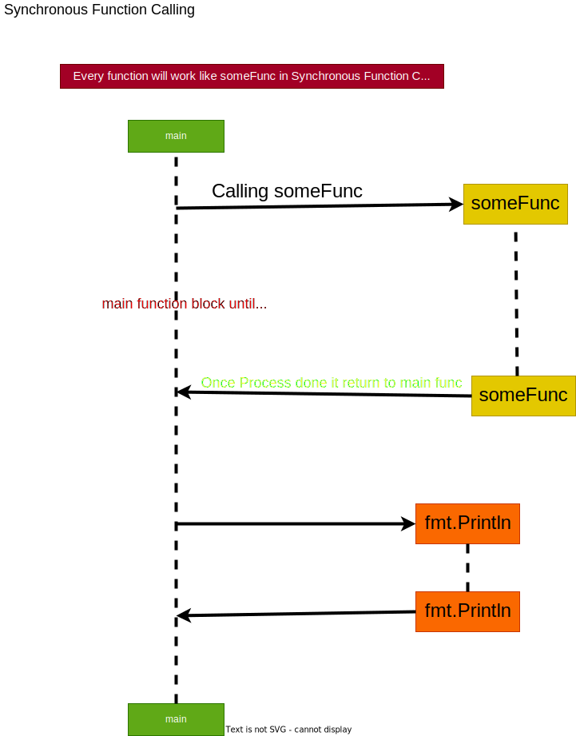
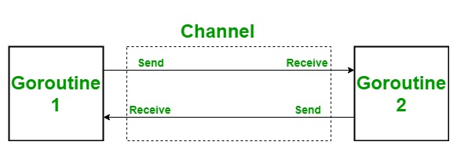

**What's the diffrence between Unbuffered & Buffered Channel**
- chan is a channel in Golang. In simple word you can think it as a box in which you put a item at one end and then pick it from other end.
1) Unbuffered Channel :<br>

2) Buffered Channel :<br>


**Goroutine vs threads**

| Thread | Goroutine |
| --- | --- |
| managed by os | manage by go run time |
| Fixed stack - 1Mb | Fixed stack - 2kb |

> [best reference video](https://youtu.be/YHRO5WQGh0k?si=DY4N2dzylzRZAerS)<br>
> [reference video](https://youtu.be/UNtSB-dprIM?si=SK9T7kIGKjJ-pmpx)<br>
> [reference blog](https://github.com/ntk148v/lets-go/blob/master/tips-notes/goroutines.md)

- Goroutine are much little (small) than threads.
- Goroutine consuming less memory than threads.
- Threads are slow.
- Goroutines are fast.
> Why threads are slow ?
> - Threads are take more than 1MP of memory for each thread. 
> - when a thread is created which has to store lot of information like'
[tag-1]
> - A single thread has to store lot of information even before starting.
> - To create or delete or remove a thread,we need to call a **OS** for each and everytime.
[tag-2]
> - Doing **OS** calls is much costlier than you expect this's also a another reason for **threads** are heavy or slow. 

> Why Goroutines are fast ?
> - Goroutines runs inside the **Go-runtime**.
[tag-3]
> - while create or delete the **Goroutine** we're not calling the **OS** instead we create or delete goroutine inside **Go-runtime**.
> Calling **OS** isn't a problem but calling much frequently is a problem.
> Threads has so many data's to store (pointer's) to create a single thread.
> But goroutine stores only few information which cost less than 2KB per goroutine.

> How does golang do this?
> - Go has **scheduler** which take care of creating or deleting or handling **goroutines** efficiently.

<mark>just a summary :</mark>

- Goroutines and threads aren't same.
- Goroutines are user-space threads.
- threads are managed by OS (kernel) but Goroutines are managed by **Goruntime**.
- Goroutines are lighter weight and faster than kernel threads.
- operating system only knows how to schedule to put kernel threads on the hardware (on your CPU core)
- Go schedular put goroutines on kernal threads which run on CPU.
- single thread can hold nth number of Goroutines.

**Cocurrency Pattern**


**Concurrency vs Parallelism :**


- Concurrency is not parallelism, although it enables parallelism.
- If you have only one processor, your program can still be concurrent but it cannot be parallel.
- On the other hand, a well-written concurrent program might run efficiently in parallel on a multiprocessor. That property could be important.

- [Concurrency vs Parallelism](https://www.youtube.com/watch?v=Y1pgpn2gOSg)
- [Concurrency is NOT Parallelism](https://www.ics.uci.edu/~rickl/courses/ics-h197/2014-fq-h197/talk-Wu-Concurrency-is-NOT-parallelism.pdf)

- Summary
    - Concurrency and parallelism are two related but distinct concepts in programming.
        - Concurrency refers to the ability of a program to handle multiple tasks simultaneously, but not necessarily at the same time.
        - Parallelism refers to the ability of a program to perform multiple tasks at the same time.
        - We can't achieve parallism in single-processor with single core.
        - But we can achieve parallism in single-processor with multicore core.
        - We can also achieve parallism in multiple-processorx.

<aside>
<h3>Goroutine life span</h3>
    - In Go <code>main</code> function also a <code>goroutine</code> which is a parent Goroutine once the parent goroutine finish all other goroutine also Exit.
</aside>

**Concurrency** refers to a programming language's ability to deal with lots of things at once.

A good way to understand concurrency is by imagining multiple cars traveling on two lanes. Sometimes the cars overtake each other, and sometimes they stop and let others pass by.

Another good example is when your computer runs multiple background tasks like messaging, downloading movies, running the operating system, and so on – all at once.

**Parallelism** means doing lots of things simultaneously and independently. It might sound similar to concurrency, but it’s actually quite different.

Let's understand it better with the same traffic example. In this case, cars travel on their own road without intersecting each other. Each task is isolated from all other tasks. Concurrent tasks can be executed in any given order.

This is a non-deterministic way to achieve multiple things at once. True parallel events require multiple CPUs.

#### Example1
```go
package main

import (
	"fmt"
)

func main(){
    someFunc("01")
	fmt.Println("a.... HI")
}

func someFunc(num string){
	fmt.Println(num)
}
```
> If you want to call this `someFunc` we should call that into the
 `main` function because that's entry point of the go program.
> 

<dl>
<dt>What happen!</dt>
  <dd>When we call this <code>someFunc</code> it runs synchronously that means our <code>main</code> function is going to be block until the completion of this <code>someFunc</code> function.  </dd>
  <dd>So below <code>print</code> statement won't run until after <code>someFunc</code> is finished running <dd>
  <dd>But with help of <mark>go routine</mark> we can actually make <code>someFunc</code> <mark>fork off</mark> of our
      <code>main</code> function <mark>asynchronously</mark>  and that would mean that <code>main</code> would not need to wait 
      for <code>someFunc</code> to finish before it could continue with its work </dd>
</dl>



**Golang follows a model of concurrency called `fork-Join`** 

## What is a Goroutine?

A goroutine is an independent function that executes simultaneously in some separate lightweight threads managed by Go. GoLang provides it to support concurrency in Go.

```go
package main

import (
	"fmt"
)

func main() {
	go helloworld()
	goodbye()
}

func helloworld() {
	fmt.Println("Hello World!")
}

func goodbye() {
	fmt.Println("Good Bye!")
}

```


Without time.Sleep():

```
$ go run HelloWorld.go
Good Bye!

```

```go
package main

import (
	"fmt"
	"time"
)

func main() {
	go helloworld()
	time.Sleep(1 * time.Second)
	goodbye()
}

func helloworld() {
	fmt.Println("Hello World!")
}

func goodbye() {
	fmt.Println("Good Bye!")
}

```


After adding time.Sleep(), the `helloworld` goroutine is able to finish its execution before main exits:

```
$ go run HelloWorld.go
Hello World!
Good Bye!

```
- But this way is not a proper way for sync our goroutine with main goroutine because we couldn't tell accurate processing time for all goroutine function in time.Sleep,some will take too long or some will take too small.

### What's the purpose of Channels?



- Go provides **channels** that you can use for communication between goroutines.
- It can only transfer data of the same type, different types of data are not allowed to transport from the same channel.

```go
// Syntax to declare a channel

ch := make(chan Type) // Bidirectional default.

// Declaration of channels based on directions

1. Bidirectional channel : chan T
2. Send only channel: chan <- T
3. Receive only channel: <- chan T

```
**Closing the channel**: 
- Closing the channel indicates that no more values should be sent through this channel.
  - Because we want to show that the work has been completed so there is no need to keep a channel open.
  - But we can read from the closing channel.

---