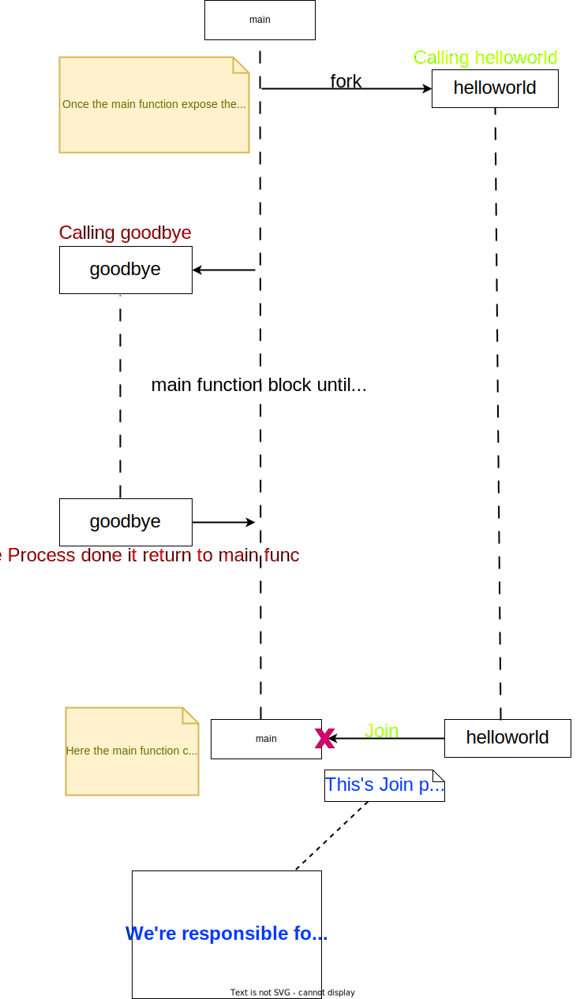

**If you need to get better at Concurrency patter you should get well at these three :**
- go routine
- channel
- select

# Which is the entry point of GO program .
   <mark>main</mark> function

<aside>
<h3>Goroutine life span</h3>
    - In Go <code>main</code> function also a <code>goroutine</code> which is a parent Goroutine once the parent goroutine finish all other goroutine also Exit.
</aside>

---

<aside>

[https://www.freecodecamp.org/news/concurrent-programming-in-go/](https://www.freecodecamp.org/news/concurrent-programming-in-go/)


**Concurrency** refers to a programming language's ability to deal with lots of things at once.

A good way to understand concurrency is by imagining multiple cars traveling on two lanes. Sometimes the cars overtake each other, and sometimes they stop and let others pass by.

Another good example is when your computer runs multiple background tasks like messaging, downloading movies, running the operating system, and so on – all at once.

**Parallelism** means doing lots of things simultaneously and independently. It might sound similar to concurrency, but it’s actually quite different.

Let's understand it better with the same traffic example. In this case, cars travel on their own road without intersecting each other. Each task is isolated from all other tasks. Concurrent tasks can be executed in any given order.

This is a non-deterministic way to achieve multiple things at once. True parallel events require multiple CPUs.


Illustration showing difference between parallelism and concurrency


#### Example1
```go
package main

import (
	"fmt"
)

func main(){
    someFunc("01")
	fmt.Println("a.... HI")
}

func someFunc(num string){
	fmt.Println(num)
}
```
> If you want to call this `someFunc` we should call that into the
 `main` function because that's entry point of the go program.
> 

<dl>
<dt>What happen!</dt>
  <dd>When we call this <code>someFunc</code> it runs synchronously that means our <code>main</code> function is going to be block until the completion of this <code>someFunc</code> function.  </dd>
  <dd>So below <code>print</code> statement won't run until after <code>someFunc</code> is finished running <dd>
  <dd>But with help of <mark>go routine</mark> we can actually make <code>someFunc</code> <mark>fork off</mark> of our
      <code>main</code> function <mark>asynchronously</mark>  and that would mean that <code>main</code> would not need to wait 
      for <code>someFunc</code> to finish before it could continue with its work </dd>
</dl>


**Golang follows a model of concurrency called `fork-Join`** 

## What is a Goroutine?

A goroutine is an independent function that executes simultaneously in some separate lightweight threads managed by Go. GoLang provides it to support concurrency in Go.

```go
package main

import (
	"fmt"
)

func main() {
	go helloworld()
	goodbye()
}

func helloworld() {
	fmt.Println("Hello World!")
}

func goodbye() {
	fmt.Println("Good Bye!")
}

```


Without time.Sleep():

```
$ go run HelloWorld.go
Good Bye!

```

```go
package main

import (
	"fmt"
	"time"
)

func main() {
	go helloworld()
	time.Sleep(1 * time.Second)
	goodbye()
}

func helloworld() {
	fmt.Println("Hello World!")
}

func goodbye() {
	fmt.Println("Good Bye!")
}

```


After adding time.Sleep(), the `helloworld` goroutine is able to finish its execution before main exits:

```
$ go run HelloWorld.go
Hello World!
Good Bye!

```
- But this way is not a proper way for sync our goroutine with main goroutine because we couldn't tell accurate processing time for all goroutine function in time.Sleep,some will take too long or some will take too small.

### What are Channels?


- Go provides **channels** that you can use for bidirectional communication between goroutines.
- Bidirectional communication means that one goroutine will send a message and the other will read it. <mark>Sends and receives are blocking</mark>. Code execution will be stopped until the write and read are done successfully.

There are a couple different types of channels:

- **Unbuffered channel**: Unbuffered channels require both the sender and receiver to be present to be successful operations. It requires a goroutine to read the data, otherwise, it will lead to deadlock. By default, channels are unbuffered.

- **Buffered channel**: Buffered channels have the capacity to store values for future processing. The sender is not blocked until it becomes full and it doesn't necessarily need a reader to complete the synchronization with every operation.

  - If a space in the array is available, the sender can send its value to the channel and complete its send operation immediately.

  - After its execution, if a receiver comes, the channel will start sending values to the receiver and it will start its operation once it receives the values. As the sender and receiver are operating at different times, this is called `asynchronous communication`.

### Creating a Channel

- A channel is created using **chan** keyword
- It can only transfer data of the same type, different types of data are not allowed to transport from the same channel.

```go
Syntax to declare a channel
ch := make(chan Type) // Bidirectional default.

```

```go
Declaration of channels based on directions
1. Bidirectional channel : chan T
2. Send only channel: chan <- T
3. Receive only channel: <- chan T

```

# Difference between declaration of variable and make

```go
// how to create a channel
package main

import "fmt"

func main() {

	// Creating a channel

	// Using var keyword

	var mychannel chan int
 /*
 # a channel of type int is declared using the var keyword without initializing it.         By default, when a channel is declared without initialization, its value is nil.
*/
	fmt.Println("Value of the channel: ", mychannel)
	fmt.Printf("Type of the channel: %T ", mychannel)

	// Creating a channel using make() function

	mychannel1 := make(chan int)
/*
# a channel of type int is created using the make() function. The make() function initializes and returns a new, initialized channel. When you use make(chan int), it creates a new channel and assigns its memory address to the variable mychannel1.
*/
	fmt.Println("\nValue of the channel1: ", mychannel1)
	fmt.Printf("Type of the channel1: %T ", mychannel1)

}
```

**Output:**

```
Value of the channel:
Type of the channel: chan int
Value of the channel1:  0x432080
Type of the channel1: chan int

```

### Bidirectional Channel

```go
package main

import (
	"fmt"
	"time"
)

func main() {
	msg := make(chan string) // declaring a channel.
	go greet(msg) // Goroutine
	greeting := <-msg // We read here,It will block until someOne send data here.
	fmt.Println("Greeting received")
	fmt.Println(greeting)
}

func greet(ch chan string) {
	fmt.Println("Greeter waiting to send greeting!")
	ch <- "Hello vignesh"  // We write here.
	fmt.Println("Greeter completed")
}

```

```go
$ go run main.go
Greeter waiting to send greeting!
Greeter completed
Greeting received
Hello vignesh

```

<aside>
👁️ UniDirectional

```go
package main

import "fmt"

// Function to send values into a send-only channel
func sendData(ch chan<- int, value int) {
    ch <- value
    close(ch)
}

// Function to receive values from a receive-only channel
func receiveData(ch <-chan int, done chan<- bool) {
    for num := range ch {
        fmt.Println("Received:", num)
    }
    done <- true
}

func main() {
    // Creating a send-only channel
    sendCh := make(chan<- int)

    // Creating a receive-only channel
    receiveCh := make(<-chan int)

    // Creating a bidirectional channel
    ch := make(chan int)

    // Assigning the send-only channel to the bidirectional channel
    sendCh = ch

    // Assigning the receive-only channel to the bidirectional channel
    receiveCh = ch

    // Creating a channel to signal the completion of receiving
    done := make(chan bool)

    // Sending a value into the send-only channel
    go sendData(sendCh, 42)

    // Receiving values from the receive-only channel
    go receiveData(receiveCh, done)

    // Waiting for receiving to complete
    <-done
}
```

- An unidirectional channel refers to a channel that is restricted to either sending or receiving values. It means that the channel can only be used in one direction, either for sending or for receiving, but not both.
</aside>

**Closing the channel**: 
- Closing the channel indicates that no more values should be sent through this channel.
  - Because we want to show that the work has been completed so there is no need to keep a channel open.

```go
package main

import (
	"fmt"
)

func main() {
	msg := make(chan string)
	go greet(msg)
	/*
	 - By using below syntax,we can know the channel is open or close by using second variable.
	 - First variable give value.
	*/
	greeting, ok := <-msg
	if ok {
		fmt.Println("result :",greeting)
		fmt.Println("Channel is open!")
	} else {
		fmt.Println("Channel is closed!")
	}
}

func greet(ch chan string) {
	fmt.Println("Greeter waiting to send greeting!")

	ch <- "Hello vignesh"
	close(ch)
	/*
	  - In above,we Close the channel means there's no more value can send through this channel
	    but we can read from this channel even after closing also too.
	*/

	fmt.Println("Greeter completed")
}

```

We close a channel by using `close()` like `close(ch)` on the above code snippet.

```go
$ go run main.go
Greeter waiting to send greeting!
Greeter completed
result : Hello vignesh
Channel is open!
```

<aside>
♻️ Here we make a Unbuffered channel then use the channel like a sync.WaitGroup

```go
package main

import (
	"fmt"
)

var count int

func PrintData(i int, ch chan int) {
	fmt.Println(i)
	ch <- 1 // Send
}

func main() {
	ch := make(chan int) // Unbuffer
	/*
	 - Defaultly channels are Unbuffer.
	*/
	for i := 1; i <= 5; i++ {
		go PrintData(i, ch)
	}
	<-ch // We read here,It will block until someOne send data here.This act like a sync.WaitGroup
	<-ch
	<-ch
	<-ch
	<-ch
}
```

- Channnel are synchronised one when we put a channel which will waiting for other end either it would be receiver or sender.
- Here we put a Receiver channel in `main` function make main goroutine to wait until their respective channel come,Here we make five receiver so it wait for five sender to send a value.
</aside>

### Channel without goroutine

> Causing error because of use `channel` without goroutine in "Unbuffered Channel”
> 

```go
    package main
    
    import "fmt"
    
    func WithoutGoroutineInUnBufferedChan() {
    	c := make(chan int) // Unbuffered Channel
    	c <- 17
    	fmt.Println(<-c)
    }
```    
<aside>
    ♻️ Reason
    
- But the reason we got deadlock is Go runtime or go scheduler detect somehow when we don’t have a respective sender or receiver in our program that will be terminated by go runtime.
- The main goroutine wait for the receiver receive a value on `c <- 17` but there’s no receiver at the time because the receiver we made next line once the sender opertion complete then only program execute the next line.
</aside>

# Select

```go

package main

import (
	"fmt"
)

func SendData(ch chan string){
      ch <- "Hello"
}

func main(){
     ch1 := make(chan string)
	 ch2 := make(chan string)

	 go SendData(ch1)

	 go func(){
         ch2 <- "Hiiii"
	 }()

	 select {
	 case data1 := <-ch1:
		fmt.Println("Getting data from channel-1 :",data1)
     case data2 := <-ch2:
		fmt.Println("Getting data from channel-2 :",data2)
	 }
}

```

- We can wait multiple goroutine in select statement if one of the case success then it end the process like a switch statement.


# Old Data

<aside>

### What are WaitGroups?

You can use WaitGroups to wait for multiple goroutines to finish. A WaitGroup blocks the execution of a function until its internal counter becomes 0.

Let's see a simple code snippet:

```go
package main

import (
	"fmt"
)

func main() {
	go helloworld()
	go goodbye()
}

func helloworld() {
	fmt.Println("Hello World!")
}

func goodbye() {
	fmt.Println("Good Bye!")
}

```

Output

```go
$ go run HelloWorld.go

```

If we run the above program, it doesn't print anything. This is because the main function got terminated as soon as those two goroutines started executing. So, we can use `Sleep` which pauses the execution of the main function. It looks like this:

```go
package main

import (
	"fmt"
	"time"
)

func main() {
	go helloworld()
	go goodbye()
	time.Sleep(2 * time.Second)
}

func helloworld() {
	fmt.Println("Hello World!")
}

func goodbye() {
	fmt.Println("Good Bye!")
}

```

Here's the output:

```go
$ go run HelloWorld.go
Good Bye!
Hello World!

```

Here, the `main` function was blocked for 2 seconds and all the goroutines were executed successfully.

Blocking the method for 2 seconds might not create any problems. But at the production level, where each millisecond is vital, millions of concurrent requests can create a huge problem.

You can solve this problem using **sync.WaitGroup** like this:

```go
package main

import (
	"fmt"
	"sync"
)

func main() {
	var wg sync.WaitGroup
	wg.Add(2)
	go helloworld(&wg)
	go goodbye(&wg)
	wg.Wait()
}

func helloworld(wg *sync.WaitGroup) {
	defer wg.Done()
	fmt.Println("Hello World!")
}

func goodbye(wg *sync.WaitGroup) {
	defer wg.Done()
	fmt.Println("Good Bye!")
}

```

Output

```go
$ go run HelloWorld.go
Good Bye!
Hello World!

```

The output is the same as the previous one, but it doesn't block the `main` for 2 seconds.

1. `wg.Add(int)`: This method indicates the number of goroutines to wait. In the above code, I have provided 2 for 2 different goroutines. Hence the internal counter wait becomes 2.
2. `wg.Wait()`: This method blocks the execution of code until the internal counter becomes 0.
3. `wg.Done()`: This will reduce the internal counter value by 1.

**NOTE**: If a WaitGroup is explicitly passed into functions, it should be added by a pointer.

♻️ Resources

- Why do we give sender value into the Goroutine.
    
    [Go - why do scheduling goroutine background workers also requires its own goroutine?](https://stackoverflow.com/questions/22606887/go-why-do-scheduling-goroutine-background-workers-also-requires-its-own-gorout)
    
- Why we use Channels.
    
    [What are channels used for?](https://stackoverflow.com/questions/39826692/what-are-channels-used-for)
    
- why we can’t use sender and receiver in the same goroutine.
    
    [Why does the use of an unbuffered channel in the same goroutine result in a deadlock?](https://stackoverflow.com/questions/18660533/why-does-the-use-of-an-unbuffered-channel-in-the-same-goroutine-result-in-a-dead)
    
- what is the difference happen in goroutine when we using buffer and unbuffer channel.
    
    [Why do we need to run unbuffered channels in go routine but buffered channels can work without go routine?](https://stackoverflow.com/questions/57860319/why-do-we-need-to-run-unbuffered-channels-in-go-routine-but-buffered-channels-ca)
    
- Visualization for How goroutine works.
    
    [Visualizing Concurrency in Go ·  divan's blog](https://divan.dev/posts/go_concurrency_visualize/)
    
- Chatgpt
    
    [Golang Channels: Communication & Concurrency](https://www.notion.so/Golang-Channels-Communication-Concurrency-4e81b721eaf44930bf637238f77a13a1?pvs=21)
    
    [ChatGPT](https://chat.openai.com/share/1d59c491-8488-43a9-a64e-994197bfbef3)
    
- Buffer Channel ChatGpt
    
    [ChatGPT](https://chat.openai.com/share/1a690213-9955-4bd3-87c6-2b38fbcd129e)
    
</aside>

# Go Concurrency

**<aside>♻️ Concurrency vs Parallelism</aside>**

✍🏿 From Offical Document

- Concurrency is not parallelism, although it enables parallelism.
- If you have only one processor, your program can still be concurrent but it cannot be parallel.
- On the other hand, a well-written concurrent program might run efficiently in parallel on a multiprocessor. That property could be important.
</aside>

<aside>
♻️ Dobuts

- If we run a go program ,will it run on single processor and single thread even that processor has multiple thread ,will it work on single thread at the time.
    - By default, when you run a Go program, it starts with a single operating system thread, even if the processor has multiple threads. This single OS thread is used to execute goroutines concurrently. This means that, at any given moment, only one goroutine can be running on the single OS thread. However, the Go scheduler will handle the switching between goroutines, making it appear as if they are running in parallel.
    - While a single OS thread is the default, the Go runtime can dynamically create additional OS threads as needed. For example, if a goroutine blocks on a system call or a blocking operation, the Go scheduler may create a new OS thread to continue executing other goroutines concurrently on a separate thread. This is known as "OS thread spinning."
    - It's important to note that the Go scheduler handles the distribution of goroutines across the available OS threads. This allows the program to fully utilize multiple CPU cores if they are available. As a result, the program can achieve true concurrency across multiple CPU cores even if it starts with a single OS thread.
    
    In summary:
    
    - By default, a Go program starts with a single operating system thread, even if the processor has multiple threads.
    - The Go scheduler multiplexes goroutines onto this single OS thread to allow concurrent execution.
    - The Go runtime can dynamically create additional OS threads if required to handle blocking operations or to optimize concurrency across multiple CPU cores.
    
    The Go runtime and scheduler are designed to make concurrent programming efficient and straightforward, allowing developers to focus on writing concurrent code without having to worry about managing threads explicitly.
    
</aside>

- Dual Processor System
    
    [DUAL CPU SERVER FOR OUR OFFICE | Unboxing Super Micro Server | வடக்கு நண்பரின் Server!](https://www.youtube.com/watch?v=jkNBWShQL40)
    
- concurrency vs Parallelism
    
    [Concurrency vs Parallelism](https://www.youtube.com/watch?v=Y1pgpn2gOSg)
    
- Concurrency is NOT Parallelism
    
    [Concurrency is NOT Parallelism](https://www.ics.uci.edu/~rickl/courses/ics-h197/2014-fq-h197/talk-Wu-Concurrency-is-NOT-parallelism.pdf)
    

**Details**

Here's a simplified overview of how the Go scheduler switches Goroutines:

1. **Goroutines and the Run Queue:**
    - Goroutines are the lightweight, user-space threads in Go. They are functions or methods that run concurrently.
    - The Go runtime maintains a "run queue," which is a data structure that holds a list of runnable Goroutines waiting to be executed.
    - When you create a new Goroutine (using the **`go`** keyword), it is added to the run queue.
2. **OS Threads (M:N Mapping):**
    - The Go runtime manages a small pool of OS threads (also known as M-threads). The number of OS threads is typically equal to the number of CPU cores available on the machine but can be adjusted using the **`GOMAXPROCS`** environment variable or the **`runtime.GOMAXPROCS`** function.
    - Goroutines are not directly bound to OS threads; instead, multiple Goroutines can be multiplexed onto a smaller number of OS threads. This is known as M:N mapping, where M Goroutines are multiplexed onto N OS threads.
3. **Work Stealing:**
    - When an OS thread finishes executing a Goroutine (for example, it hits a blocking operation or yields the CPU voluntarily), it requests more work from the scheduler.
    - If there are Goroutines in its own local run queue, the thread takes one of them and continues execution.
    - If its local run queue is empty, the thread attempts to "steal" work from other OS threads' run queues. This mechanism is known as "work stealing" and helps balance the load among OS threads.
4. **Context Switching:**
    - When the Go scheduler switches from one Goroutine to another (either due to work stealing or a Goroutine yielding the CPU), it performs a context switch.
    - A context switch involves saving the current state of the Goroutine (registers, stack pointer, etc.) and restoring the state of the Goroutine to be executed next.
    - Context switching in Go is designed to be lightweight and efficient, which is crucial for the performance of concurrent programs.

The Go scheduler continuously repeats these steps, efficiently managing the execution of Goroutines across a pool of OS threads. This allows Go programs to take advantage of multiple cores and handle a large number of concurrent tasks without relying on one-to-one thread-to-Goroutine mappings. The details of the scheduler's implementation and optimizations are continuously evolving as the Go language evolves and as newer versions of Go are released.


Thread Vs Goroutine

| Thread | Goroutine |
| --- | --- |
| managed by os | manage by go run time |
| Fixed stack - 1Mb | Fixed stack - 2kb |

### Concurrency and parallelism

[What is the difference between concurrency and parallelism?](https://stackoverflow.com/questions/1050222/what-is-the-difference-between-concurrency-and-parallelism)

[What is the difference between concurrency and parallelism?](https://stackoverflow.com/questions/1050222/what-is-the-difference-between-concurrency-and-parallelism)

[Blob-Master](https://github.com/Criviere/os/blob/master/Chapter4.md)

</aside>

- Summary
    - Concurrency and parallelism are two related but distinct concepts in programming.
        - Concurrency refers to the ability of a program to handle multiple tasks simultaneously, but not necessarily at the same time.
        - Parallelism refers to the ability of a program to perform multiple tasks at the same time.

Examples:

- Concurrency in Go is achieved through the use of goroutines, which are lightweight threads that run in the same address space as the main program.
    - Example: A web server handling multiple client requests concurrently

```
Copy code
package main

import (
    "fmt"
    "net/http"
)

func main() {
    http.HandleFunc("/", func(w http.ResponseWriter, r *http.Request) {
        fmt.Fprintf(w, "Hello, %q", r.URL.Path)
    })

    http.ListenAndServe(":8080", nil)
}

```

- Parallelism in Go is achieved through the use of the **`go`** keyword, which allows you to run a function in a separate goroutine.
    - Example: A program that calculates the value of pi in parallel using Monte Carlo method

```
Copy code
package main

import (
    "fmt"
    "math/rand"
    "time"
)

func monteCarloPi(n int) float64 {
    inside := 0
    for i := 0; i < n; i++ {
        x := rand.Float64()
        y := rand.Float64()
        if x*x+y*y <= 1 {
            inside++
        }
    }
    return 4 * float64(inside) / float64(n)
}

func main() {
    rand.Seed(time.Now().UnixNano())
    n := 10000000
    pi := monteCarloPi(n)
    fmt.Println("Pi:", pi)
}

```

Note:

- Goroutines are lightweight, and thousands or even millions of goroutines can be run concurrently on a modern machine with limited memory overhead.
- The Go runtime automatically schedules goroutines on available cores, so that your program can take full advantage of parallelism on multi-core systems.

