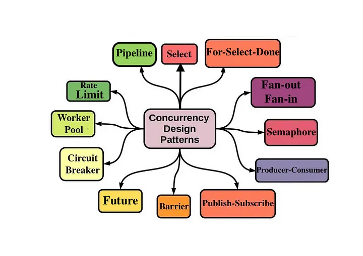

# Cocurrency Pattern

# Old Data

[Go Concurrency Patterns](https://go.dev/talks/2012/concurrency.slide#13)

[Go Concurrency Patterns: Pipelines and cancellation - The Go Programming Language](https://go.dev/blog/pipelines)

[Advanced Concurrency Patterns | Learn Go](https://www.karanpratapsingh.com/courses/go/advanced-concurrency-patterns)

["Beginning Concurrency Patterns" - "Benji Vesterby | Principal Security Software Engineer"](https://benjiv.com/beginning-concurrency-patterns/)

[Google I/O 2012 - Go Concurrency Patterns](https://www.youtube.com/watch?v=f6kdp27TYZs)

[Concurrency is not Parallelism by Rob Pike](https://www.youtube.com/watch?v=oV9rvDllKEg)

[Go-concurrency-patterns](https://github.com/lotusirous/go-concurrency-patterns/tree/main/15-bounded-parallelism)

[How To Use Contexts in Go  | DigitalOcean](https://www.digitalocean.com/community/tutorials/how-to-use-contexts-in-go)

<aside>
📌 Important Concurrency Concepts

- Work Pool
    
    [Go Concurrency Pattern: Worker Pool](https://medium.com/code-chasm/go-concurrency-pattern-worker-pool-a437117025b1)
    
    [Go by Example: Worker Pools](https://gobyexample.com/worker-pools)
    
    [Golang Concurrency — Worker Pool](https://blog.devgenius.io/golang-concurrency-worker-pool-2aff9cbc6255)
    
- Summary
    - **Worker Pool** means we have a lots of **task** to do but we have lesser **amount** of worker only so we make **queue** for that task.
</aside>

</aside>